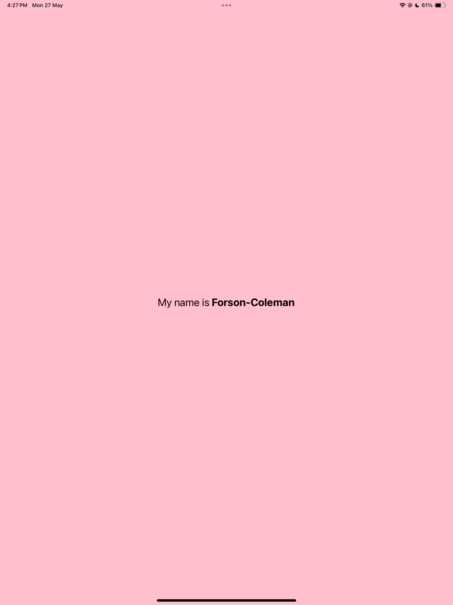

DCIT 202- MOBILE APP DEVELOPMENT
In this task i created a basic app, "App.js". I changed the background color of the view component to 'Pink'
After doing that, i then changed the text component to reveal "My name is Forson-Coleman"
I wanted the font size to be a bit larger so increased the font size of the entire string to 24. 
To complete the task i made "Forson-Coleman" bold so it stands out.

